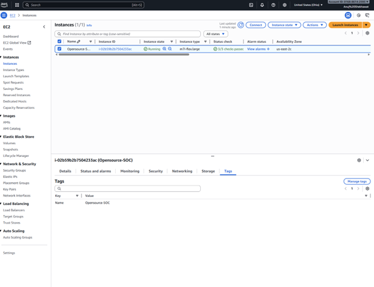
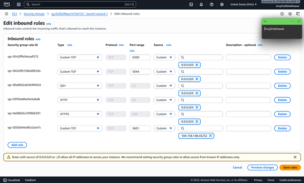
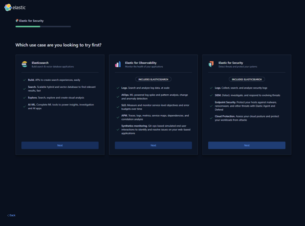
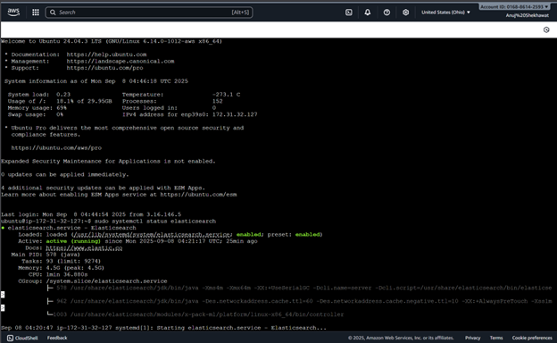
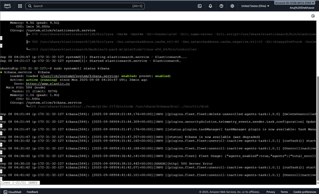

# INSTALL.md

## Assumptions
- AWS VPC with 3 VMs:
  - VM1: ELK (Elasticsearch, Logstash, Kibana)
  - VM2: TheHive, Cassandra, Cortex, MISP
  - VM3: Log generator (Linux/Windows, Snort)
- Ubuntu 20.04/22.04 LTS
---

Ubuntu VM dedicated to ELK SIEM

---

Inbound Security Rules for ELK SIEM VM

---

## Phase 1: ELK

1. Install Java
sudo apt update
sudo apt install -y openjdk-11-jdk

----

3. Install Elasticsearch
wget -qO - https://artifacts.elastic.co/GPG-KEY-elasticsearch | sudo apt-key add -
sudo apt install apt-transport-https
echo "deb https://artifacts.elastic.co/packages/8.x/apt stable main" | \
  sudo tee /etc/apt/sources.list.d/elastic-8.x.list
sudo apt update && sudo apt install elasticsearch
sudo systemctl enable --now
elasticsearch

----

4. Install Kibana
sudo apt install kibana
sudo systemctl enable --now kibana

---

5. Install Logstash / Filebeat
sudo apt install filebeat
sudo systemctl enable --now filebeat

---

## Phase 2: TheHive + Cassandra + Cortex + MISP
1. Cassandra
sudo apt install cassandra
sudo systemctl enable --now cassandra

2. TheHive
sudo apt install thehive
sudo systemctl enable --now thehive

3. Cortex & MISP

Install via official docs.
Integrate Cortex analyzers with TheHive.
Connect MISP as a threat intel source.

