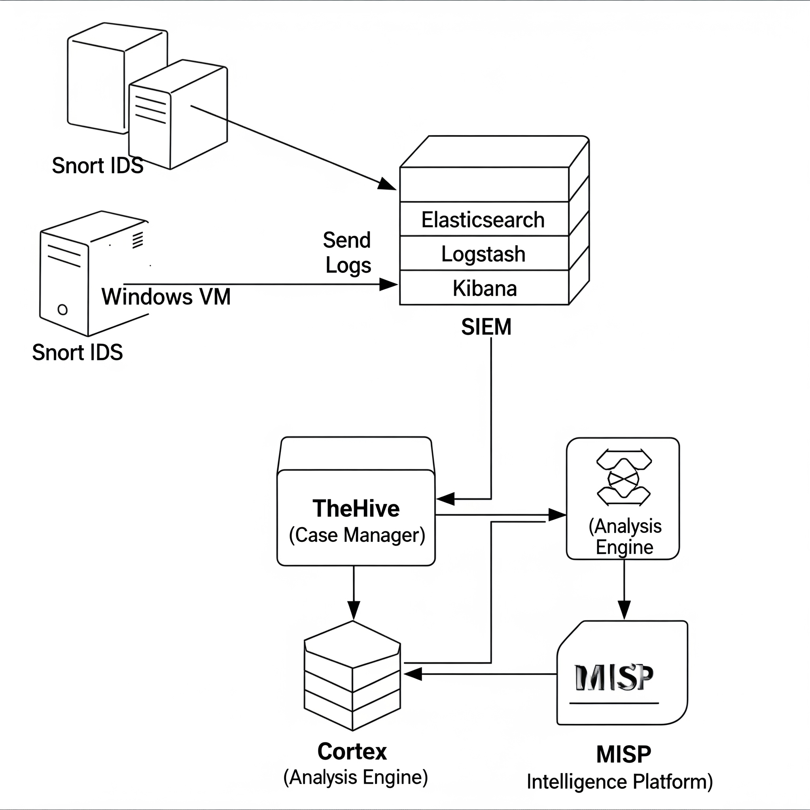

# Open SOC with  ELK + TheHive + Cortex + MISP 

This repository documents a personal proof-of-concept Open SOC built on **Ubuntu VMs in AWS**.

**Project author:** Anuj Shekhawat  
**Scope:** Single VPC with 2 primary VMs + separate log generator VM (Linux/Windows/Snort).  
**Phase 1 (completed):** ELK (Elasticsearch, Logstash, Kibana) on VM1 — SIEM ingestion, dashboards, rule tuning.  
**Phase 2 (in progress):** TheHive + Cassandra + Cortex + MISP on VM2 — alert management, case response, enrichment.

# Repository structure
```text
opensource-soc/
├── README.md
├── INSTALL.md
├── architecture_diagram.png
└── screenshots/
    ├── poc_screenshot_1.png   # Cassandra running 
    └── poc_screenshot_2.png   # TheHive running 

## Architecture




## Assumptions
- Provider: AWS (single VPC).
- 3 VMs (recommended):
  - VM1 (ELK): Elasticsearch, Kibana, Logstash/Filebeat
  - VM2 (TheHive stack): TheHive, Cassandra, Cortex, MISP (TheHive + Cortex + MISP can be colocated for PoC)
  - VM3 (Log generator): Linux or Windows (snort, syslog, agent, etc.)
- Ubuntu 20.04 LTS or 22.04 LTS (commands below tested for these).
- You have sudo on each VM and basic networking (security groups/ports) opened between VMs:
  - Elasticsearch: 9200 (cluster/HTTP) - restrict to internal VPC
  - Kibana: 5601 (web UI)
  - TheHive: 9000 (default UI port)
  - Cassandra: 9042 (CQL)
  - Cortex: 9001 (default)
  - MISP: 80/443 (or whatever you configure)

---

## Quick notes (compatibility)
- TheHive 5.3+ supports Elasticsearch 8.x (and OpenSearch in some cases). Check TheHive/Cortex docs for exact supported ES versions for the version you install. :contentReference[oaicite:0]{index=0}
- Cassandra recommended: 4.1.x for TheHive. :contentReference[oaicite:1]{index=1}
- Use Java 11 (TheHive recommended Amazon Corretto 11). :contentReference[oaicite:2]{index=2}
